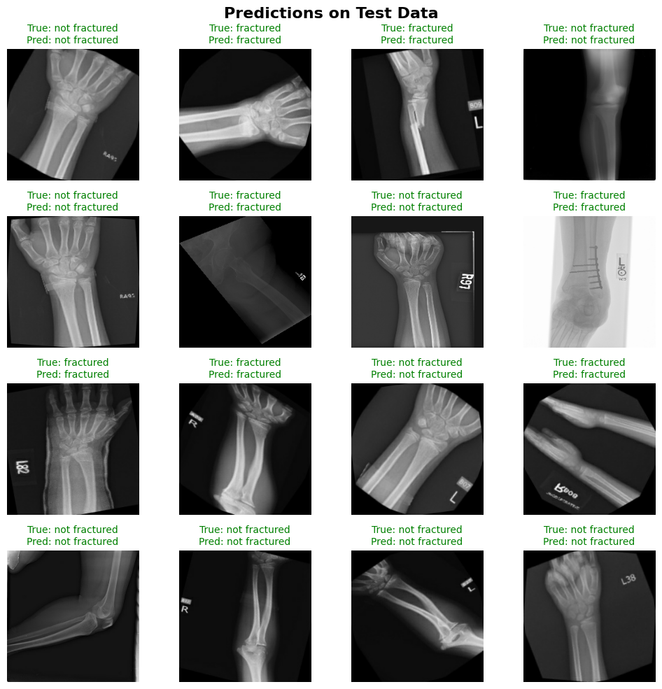

# Bone Fracture Detection in X-Ray Images Using Pre-Trained CNNs

## Overview

Fractures are a common clinical problem, and **radiographic imaging (X-rays)** remains the most accessible and widely used diagnostic tool for detecting them. Manual interpretation of X-rays can be time-consuming and subject to human error, especially when the fracture is subtle or the image quality is poor. 

This project aims to automate the **binary classification of bone X-rays** into:
- **Fractured**
- **Not Fractured**

Using **deep learning and transfer learning** techniques. We leverage the power of pre-trained convolutional neural networks to achieve high accuracy in fracture detection from raw X-ray images.

## Dataset

**📁 Source**: [Fracture Multi-Region X-ray Dataset on Kaggle](https://www.kaggle.com/datasets/bmadushanirodrigo/fracture-multi-region-x-ray-data)

- Over **10,000 images** across **7 body regions**:
  - Elbow, Finger, Forearm, Hand, Humerus, Shoulder, Wrist
- Split into `train`, `validation`, and `test` sets
- Each subset contains images categorized as:
  - `fractured`
  - `not fractured`

Images vary in size, contrast, and orientation, which makes **data preprocessing and augmentation** essential.

## 🧠 Deep Learning Models Used

We implemented and compared two powerful **transfer learning** architectures using **TensorFlow/Keras**:

### 1. **MobileNetV2**
-  Lightweight CNN designed for efficiency on mobile and edge devices
- Uses **depthwise separable convolutions** to reduce computation
- **~3.4 million parameters**
- Pros: Fast, memory efficient  
- Cons: Lower capacity, slightly lower accuracy on complex tasks

### 2. **ResNet50**
- Deep Residual Network with **50 layers**
- Introduced **residual (skip) connections** to ease training of deep networks
- **~25 million parameters**
- Pros: High accuracy, handles vanishing gradients well  
- Cons: More computationally expensive

> ✅ **Best results were obtained with ResNet50**, achieving **98% test accuracy**, significantly outperforming MobileNetV2.

## Workflow

Here’s a breakdown of how the pipeline is structured:

### 📁 1. Data Loading & Preprocessing
- Dataset loaded from Kaggle 
- Used `image_dataset_from_directory()` to create TensorFlow datasets

### 🔄 2. Data Augmentation
To improve generalization, especially due to varied orientations and lighting:
- Random rotation
- Zoom
- Rescaling to [0, 1]

### 🧠 3. Model Building
Two custom models were built using transfer learning:
- Load base model (MobileNetV2 or ResNet50 with `include_top=False`)
- Freeze base layers initially
- Add classification head:
  - Global Average Pooling
  - Dense layer
  - Output: Sigmoid activation for binary classification

### 🏋️‍♀️ 4. Training
- Optimizer: `Adam`
- Loss: `BinaryCrossentropy`
- Metrics: `Accuracy`
- Callbacks used:
  - `EarlyStopping`
  - `ModelCheckpoint` (saved best model)

### 📉 5. Evaluation & Visualization
- Training vs. validation accuracy/loss plots
- Confusion matrix and classification report on test set
- Sample predictions visualized with matplotlib

## 📊 Results

### ResNet50 **confusion matrix** after fine tuning:

  

### Predictions on Test Data:

## Conclusion

This project demonstrates that **transfer learning**, particularly with deep architectures like **ResNet50**, is highly effective for detecting fractures in X-ray images. With minimal preprocessing and moderate training effort, our model achieves **state-of-the-art accuracy (98%)** on a real-world medical imaging dataset.

This solution can potentially:
- Assist radiologists in preliminary screenings
- Serve as a tool for faster diagnosis in low-resource settings
- Be extended to multi-class classification for regional fracture identification

